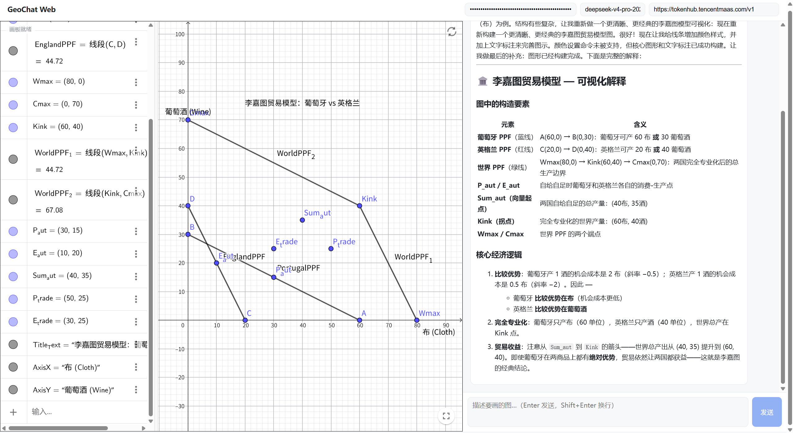
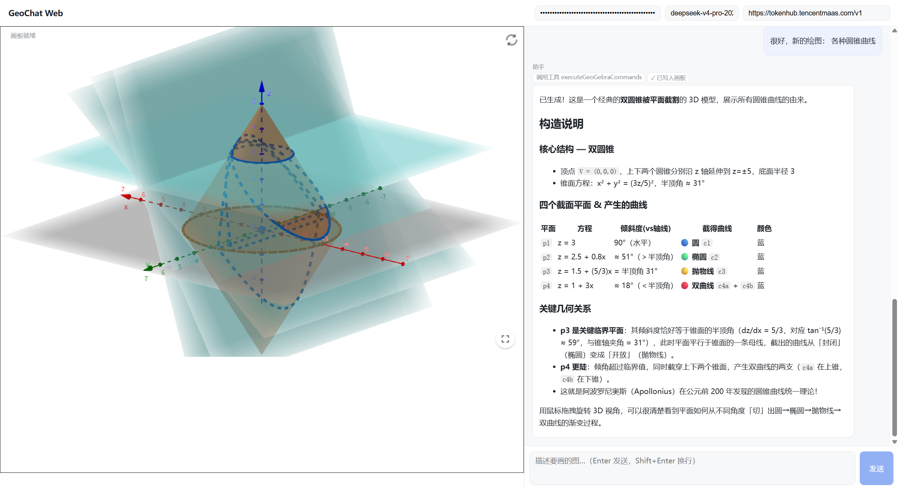

# Geogebra Webchat — AI 驱动的数学几何画板

> 一句话在浏览器里创建可交互的数学图形。输入自然语言描述，AI 自动生成 GeoGebra 命令并在实时画板中呈现。

---

## 谁适合用这个项目？

- **学生和教师**：想要快速创建数学几何图形辅助学习和教学，无需学习复杂的 GeoGebra 命令语法
- **数学/科研爱好者**：需要可视化函数、几何关系或数学模型
- **前端开发者**：对 AI 集成（Vercel AI SDK）、SolidJS 实践、数学可视化感兴趣
- **教育技术探索者**：研究如何将大语言模型与专业软件结合，降低使用门槛

---

## 项目背景与解决的需求

GeoGebra 是一款优秀的动态数学软件（Geometry + Algebra），全球用户超过 1 亿。然而，使用 GeoGebra 需要掌握其特定的命令语法，对初学者构成门槛。

与此同时，大语言模型在理解和生成自然语言方面的能力不断提升。**Geogebra Webchat 的核心思路**：让用户用自然语言描述数学问题，AI 自动转化为 GeoGebra 命令，在画板上实时构造图形，并用文字解释几何关系。

这带来了几个根本性的变化：
- **降低门槛**：不用记命令，说人话就行
- **提高效率**：一句「画一个正四面体并标出外接球」秒出结果
- **拓展场景**：经济学图表、物理模型、3D 几何都可以用自然语言生成

---

## 核心功能

- **自然语言作图**：输入数学/几何问题，AI 自动生成并执行 GeoGebra 命令
- **实时交互画板**：拖拽、缩放、旋转，图形与代数区联动
- **流式 Markdown 渲染**：AI 解释步骤实时显示，公式用 KaTeX 渲染
- **2D / 3D 支持**：平面几何和立体图形均可
- **多模型兼容**：通过 OpenAI 兼容 API，可切换任意大模型（DeepSeek、通义千问、GPT 等）
- **服务端 Key 注入**：可选隐藏 API Key，不暴露给浏览器

---

## 实际效果

```
输入：Draw a triangular pyramid (tetrahedron) and then draw its circumscribed sphere
输入：美国总统证明勾股定理图示
输入：经济学的李嘉图贸易理论
输入：各种圆锥曲线
```





---

## 技术栈

- **前端**：SolidJS + Vite，`marked` 渲染 Markdown，KaTeX 渲染公式
- **AI**：Vercel `ai` SDK v6，浏览器内 `streamText({ stopWhen: stepCountIs(6) })` 跑工具调用循环
- **GeoGebra**：官方 CDN `deployggb.js`，无需本地 vendor 文件
- **后端**：一个 Bun 单文件 `/api/llm-proxy`，透明转发 + 解决 CORS + 可选服务端 Key 注入

## 目录

```
geochat-web/
├── index.html
├── package.json
├── vite.config.ts
├── tsconfig.json
├── src/
│   ├── main.tsx
│   ├── App.tsx              # 聊天 + 画板 布局
│   ├── ai-client.ts         # streamText + 工具循环（核心）
│   ├── geogebra.ts          # CDN 加载 + 画板控制
│   ├── styles.css
│   └── lib/normalize.ts     # 命令规范化（中文别名→英文）
└── server/
    └── proxy.ts             # LLM 代理 + 静态托管
```

## 快速开始

需要 [Bun](https://bun.sh) 运行时。

```sh
cd geochat-web
bun install
```

开发模式（两个终端）：

```sh
# 终端 1：LLM 代理
bun run proxy

# 终端 2：前端
bun run dev
```

打开 http://localhost:5173 ，右上角填入 API Key 和模型名（默认 `deepseek-v4-pro`），输入题目即可。

> 设置环境变量 `MODEL_API_KEY=sk-...` 后启动代理，服务端自动注入 Key，前端无需填写、Key 不暴露给浏览器。

注意：AI 能力需达到 **DeepSeek-v4-pro / GPT-5 级别**才能稳定绘图。

生产模式：

```sh
bun run build          # 构建静态文件到 dist/
bun run start          # 代理同时托管 dist/ 与 /api
# 访问 http://localhost:8787
```

---

## 核心流程与原理

### 整体数据流

```
用户输入 ──→ App.sendMessage()
                │
                ▼
         runChat()  ← streamText({ model, system, tools, stopWhen })
                │
                ├── 模型 → 工具调用(executeGeoGebraCommands)
                │           │
                │           ▼
                │     normalize.ts (中文别名→英文, 语法修正)
                │           │
                │           ▼
                │     GeoGebra 画板 (evalCommand)
                │           │
                │           ▼
                │     返回 XML 快照 + ok/failed → 模型
                │
                ├── 模型 → 文本增量(text-delta)
                │           │
                │           ▼
                │     marked.parse → innerHTML (实时流式渲染)
                │
                └── 循环直到 stopWhen(stepCountIs(6)) 或模型产出解释
```

### 1. 消息入口 — `App.tsx`

用户输入文本 → `sendMessage()` 创建两个 `UiMessage`（user + assistant 占位）→ 积累 `ModelMessage[]` 历史 → 调用 `runChat()`。

`UiMessage` 用于 UI 渲染（含 `activity` 字段展示工具调用状态），`ModelMessage` 用于 AI SDK 的消息历史，两者分开维护。

### 2. AI 工具循环 — `ai-client.ts`

`runChat()` 调用 Vercel `ai` SDK v6 的 `streamText()`：

```typescript
streamText({
  model: openai.chat(opts.model),  // Chat Completions API
  system: SYSTEM_PROMPT,            // 角色设定：几何作图助手
  messages,                         // 消息历史
  stopWhen: stepCountIs(6),         // 最多 6 步工具循环
  tools: { executeGeoGebraCommands, resetCanvas },
})
```

`stopWhen: stepCountIs(6)` 的工作方式：
- 每次模型返回后，SDK 检查「已完成的步骤数」
- 如果 < 6，将工具结果送回模型继续
- 如果 ≥ 6，截断并返回已累积的文本
- 这替代了传统 Agent 线束中的 while 循环

工具 `executeGeoGebraCommands` 接收参数：
- `commands: string[]` — GeoGebra 命令数组
- `perspective?: string` — 可选视角（G=2D, T=3D, AG=代数+图形）
- `resetBefore?: boolean` — 是否清空画板

`execute` 回调执行流程：
1. `normalizeGeoGebraCommands(commands)` — 命令规范化
2. `controller.executeCommands(norm, opts)` — 在 GeoGebra 画板依次执行
3. 返回 `{ ok, failed, xml }` — 结果 + XML 快照回灌给模型

### 3. 命令规范化管道 — `src/lib/normalize.ts`

大模型可能输出中文别名或简写，在执行前需统一成 GeoGebra 5 兼容的英文命令：

```
原始命令                    → 规范化后
─────────────────────────────────────────────
描点((0,0))                → (0, 0)
描点(f)                    → Point(f)
设置颜色(A,red)            → SetColor(A,red)
中点(A,B)                  → Midpoint(A,B)
```

处理步骤按顺序：
1. **去空白/去空行**
2. **中文别名替换** — 遍历 `ALIAS` 字典（如 `描点→Point`），前缀匹配（多字优先）
3. **SetOpacity → SetFilling** — GeoGebra 5 兼容
4. **Point((x,y)) → (x, y)** — 修正 `Point((坐标))` 这种 GeoGebra 非法语法

### 4. GeoGebra 画板集成 — `src/geogebra.ts`

**加载流程：**
1. 动态创建 `<script>` 加载 `https://www.geogebra.org/apps/deployggb.js`
2. 脚本加载后实例化 `GGBApplet` 并注入到 DOM 容器
3. `appletOnLoad` 回调中保存 API 引用，标记就绪

**命令执行：**
- 优先使用 `api.evalCommand()`（同步返回 boolean），回退到 `api.asyncEvalCommandResult()`
- 命令之间插入 80ms 延迟，防止 GeoGebra 内部竞争
- `restoreOnError`：任一命令失败时，自动恢复执行前的 XML 快照，避免画板进入脏状态

**控制器 API：**
- `executeCommands(commands, opts)` — 批量执行命令
- `reset()` — 清空所有对象
- `setPerspective(mode)` — 切换视角
- `getXML()` — 读取当前画板状态

### 5. LLM 代理 — `server/proxy.ts`

```
浏览器 (Vite :5173)                     Bun 代理 (:8787)                  LLM API
      │                                      │                              │
      │── POST /api/llm-proxy ──────────────→│                              │
      │  headers: {                           │                              │
      │    x-target-url: <实际 LLM API URL>,   │                              │
      │    authorization: Bearer sk-...        │                              │
      │  }                                     │                              │
      │                                       │── POST <target-url> ───────→│
      │                                       │   (透传 body + headers)     │
      │                                       │←───── 200/stream ──────────│
      │←──── stream ────────────────────────│                              │
```

为什么需要代理层：
- **CORS 解决**：浏览器直调第三方 LLM API 会跨域，同源代理转发解决
- **API Key 保护**（可选）：`MODEL_API_KEY` 环境变量让服务端注入 Key，前端无需暴露
- **主机白名单**：`ALLOWED_HOSTS` 控制允许的目标，防止滥用
- **自定义主机**：`x-custom-hostname` 请求头让用户自定义 base URL 时也能通过白名单

### 6. 流式渲染

`result.fullStream` 是一个 AsyncIterable，包含多种事件类型：

| 事件类型 | 处理方式 |
|---------|---------|
| `text-delta` | 追加到助理消息的 `content`，`marked.parse()` 实时渲染为 HTML |
| `tool-call` | 添加 activity chip「调用工具 xxx」 |
| `tool-result` | 添加 activity chip「✓ 已写入画板」 |
| `error` | 添加 activity chip「⚠ 错误信息」 |

---

## 状态管理

使用 SolidJS 信号（signal），无外部状态库：

| 信号 | 用途 | 持久化 |
|-----|------|-------|
| `apiKey` | OpenAI API Key | localStorage (`geochat-web-key`) |
| `model` | 模型名 | localStorage (`geochat-web-model`) |
| `baseUrl` | 自定义 API Base URL | localStorage (`geochat-web-base-url`) |
| `messages` | UI 消息列表（含 activity） | 无（会话级） |
| `coreMessages` | AI SDK 消息历史 | 无（会话级） |
| `input` | 输入框内容 | 无 |
| `running` | 是否正在请求 | 无 |
| `ggbReady` | 画板是否就绪 | 无 |

---

## 与完整版 GeoChat (Tauri) 的取舍

| 能力 | 极简版 | 完整版 |
|-----|-------|--------|
| Agent 循环 | `stopWhen(stepCountIs(6))` + prompt 提示 | 状态机线束 + 账本 + 重试 |
| 命令保证 | 命中退回到上一次 XML | 线束保证每步幂等 |
| 离线 | 否（GeoGebra CDN） | 是（vendor 目录） |
| 存储 | 无（纯会话） | SQLite + Drizzle |
| 多供应商 | `@ai-sdk/openai` + 代理转发 | 多 provider + 远程工具桥 |
| 本地 LLM | base URL 自定义 | sidecar 进程 |

**去掉**：Tauri 外壳、Bun sidecar、SQLite/Drizzle、Agent 线束/账本/远程工具桥、题库、技能库、高级绘图宏、vendor(159MB)。

**保留**：SolidJS、GeoGebra 控制器（精简）、命令规范化、`ai` SDK 多供应商能力、流式渲染。

---

## 换供应商

`src/ai-client.ts` 现用 `@ai-sdk/openai`。换 Anthropic / DeepSeek / 通义千问 / OpenRouter 时，改用对应 provider 包的工厂函数即可，代理对其一视同仁。

---

## 未来可能的扩展方向

- 更多 AI 模型支持（Claude、Gemini 等）
- 图片上传 + 视觉理解（拍照解题）
- 更丰富的交互体验
- 与数学题库系统集成

---

## 参考

- 灵感来源：[tiwe0/GeoChat](https://github.com/tiwe0/GeoChat)
- [GeoGebra 官网](https://www.geogebra.org/)
- 感谢 [linux.do](https://linux.do) 佬友支持
