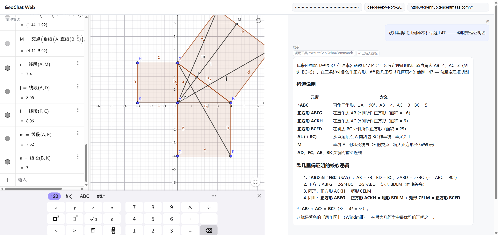
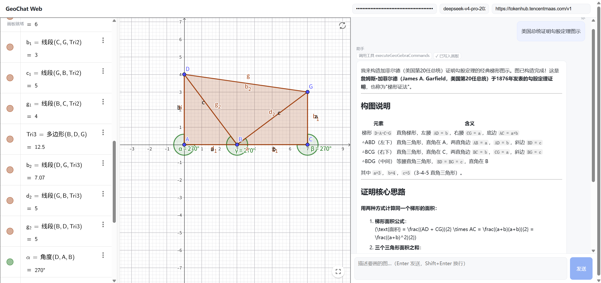

# Geogebra-WebChat（极简版）

只保留核心链路：**聊天 + AI + GeoGebra 画图**。简单普通 Web 应用，但是功能齐全。

参考了开源项目：https://github.com/tiwe0/GeoChat

GeoGebra 画板是中文用户对 GeoGebra​ 的俗称，它本质上不是普通的"画图工具"，而是一款免费、开源的动态数学软件——由奥地利数学家 Markus Hohenwarter 于 2001 年创建，名字来自 Geometry（几何）+ Algebra（代数）的组合。

### 🎯 它到底是什么

简单说，它是一个可以互动的数学实验室：把交互式 2D/3D 几何、代数、表格、函数绘图、统计、微积分整合进同一个软件，各模块之间动态联动——你在画板上拖动点或改参数，代数区里对应的坐标、方程会实时跟着变；反过来在指令栏输入方程，画板上也会立刻出现对应图形。

它被全球教育界广泛采用：用户超过 1 亿，提供超过 100 万种由社区教师制作的免费互动资源，2021 年加入 BYJU 集团后继续免费开放。

### 🧩 核心功能

几何作图：画点、线、圆、多边形、圆锥曲线等，支持拖拽、测量、变换

代数运算：直接输入方程、函数、坐标，自动生成对应图形

函数绘图：绘制函数图像、曲线，探索导数、积分、极限

3D 绘图：创建和探索三维立体图形

统计与概率：处理数据、绘制统计图表、计算概率分布

微积分：函数求导、积分、计算极值

交互元素：滑块、动画、动态模型，用于演示和探究

CAS 计算机代数系统：符号计算

电子表格：像 Excel 一样处理数据


## 技术栈

- **前端**：SolidJS + Vite；`streamdown` 未用，改用 `marked` 渲染 Markdown。
- **AI**：Vercel `ai` SDK v6，浏览器内 `streamText({ stopWhen: stepCountIs(6) })` 跑工具循环，工具 `execute` 直接写 GeoGebra 画板。
- **GeoGebra**：官方 CDN `deployggb.js`，无需本地 vendor。
- **后端**：一个 Bun 单文件 `/api/llm-proxy`，透明转发 + 解决 CORS + 主机白名单；生产模式顺便托管 `dist/`。

## 目录

```
geochat-web/
├── index.html
├── package.json
├── vite.config.ts
├── tsconfig.json
├── src/
│   ├── main.tsx
│   ├── App.tsx              # 聊天 + 画板 布局
│   ├── ai-client.ts         # streamText + 工具循环（核心）
│   ├── geogebra.ts          # CDN 加载 + 画板控制
│   ├── styles.css
│   └── lib/normalize.ts     # 命令规范化（中文别名/简写）
└── server/
    └── proxy.ts             # LLM 代理 + 静态托管
```

## 运行

需要 Bun（主项目已用）。安装：

```sh
cd geochat-web
bun install
```

开发模式（两个终端）：

```sh
# 终端 1：启动 LLM 代理
bun run proxy

# 终端 2：启动前端
bun run dev
```

打开 http://localhost:5173 ，在右上角填入 OpenAI API Key 和模型名（默认 `deepseek-v4-pro`），输入题目即可。

> 也可在启动代理前设置 `MODEL_API_KEY` 环境变量，由服务端注入 Key，前端就不用填、也不暴露：
> `MODEL_API_KEY=sk-... bun run proxy`

注意： 务必要AI能力达到 deepseek-v4-pro 才能正常绘图！


生产模式：

```sh
bun run build          # 产出 dist/
bun run start          # 代理同时托管 dist/ 与 /api
# 访问 http://localhost:8787
```


### 实际效果：




## 核心流程与原理

### 整体数据流

```
用户输入 ──→ App.sendMessage()
                │
                ▼
         runChat()  ← streamText({ model, system, tools, stopWhen })
                │
                ├── 模型 → 工具调用(executeGeoGebraCommands)
                │           │
                │           ▼
                │     normalize.ts (中文别名→英文, 语法修正)
                │           │
                │           ▼
                │     GeoGebra 画板 (evalCommand)
                │           │
                │           ▼
                │     返回 XML 快照 + ok/failed → 模型
                │
                ├── 模型 → 文本增量(text-delta)
                │           │
                │           ▼
                │     marked.parse → innerHTML (实时流式渲染)
                │
                └── 循环直到 stopWhen(stepCountIs(6)) 或模型产出解释
```

### 步骤详解

#### 1. 消息入口 — `App.tsx`

用户输入文本 → `sendMessage()` 创建两个 `UiMessage`（user + assistant 占位）→ 积累 `ModelMessage[]` 历史 → 调用 `runChat()`。

关键：`UiMessage` 用于 UI 渲染（含 `activity` 字段展示工具调用状态），`ModelMessage` 用于 AI SDK 的消息历史。两者分开维护。

#### 2. AI 工具循环 — `ai-client.ts`

`runChat()` 调用 Vercel `ai` SDK v6 的 `streamText()`：

```typescript
streamText({
  model: openai.chat(opts.model),  // 使用 Chat Completions API (非 Responses API)
  system: SYSTEM_PROMPT,            // 角色设定：几何作图助手
  messages,                         // 消息历史
  stopWhen: stepCountIs(6),         // 最多 6 步工具循环
  tools: { executeGeoGebraCommands, resetCanvas },
})
```

`stopWhen: stepCountIs(6)` 的工作方式：
- 每次模型返回后，SDK 检查「已完成的步骤数」
- 如果 < 6，将工具结果送回模型继续
- 如果 ≥ 6，截断并返回已累积的文本
- 这替代了传统 Agent 线束中的 while 循环

工具 `executeGeoGebraCommands` 接收参数：
- `commands: string[]` — GeoGebra 命令数组
- `perspective?: string` — 可选视角（G=2D, T=3D, AG=代数+图形）
- `resetBefore?: boolean` — 是否清空画板

`execute` 回调执行流程：
1. `normalizeGeoGebraCommands(commands)` — 命令规范化
2. `controller.executeCommands(norm, opts)` — 在 GeoGebra 画板依次执行
3. 返回 `{ ok, failed, xml }` — 结果 + XML 快照回灌给模型

#### 3. 命令规范化管道 — `src/lib/normalize.ts`

大模型可能输出中文别名或简写，在执行前需统一成 GeoGebra 5 兼容的英文命令：

```
原始命令                    → 规范化后
─────────────────────────────────────────────
描点((0,0))                → (0, 0)
描点(f)                    → Point(f)
设置颜色(A,red)            → SetColor(A,red)
设置不透明度(obj,0.5)      → SetFilling(obj,0.5)
中点(A,B)                  → Midpoint(A,B)
p=(1,2)                    → p=(1,2)     (不变，GeoGebra 原生支持)
A=(0,0)                    → A=(0,0)     (不变，大写命名点保留)
f(x)=x^2                   → f(x)=x^2    (不变，函数定义保留)
```

处理步骤按顺序：
1. **去空白/去空行**
2. **中文别名替换** — 遍历 `ALIAS` 字典（如 `描点→Point`），前缀匹配
3. **SetOpacity → SetFilling** — GeoGebra 5 兼容
4. **Point((x,y)) → (x, y)** — 修正 `Point((坐标))` 这种 GeoGebra 非法语法（只有纯数值坐标触发，对象引用如 `Point(f)` 不变）

#### 4. GeoGebra 画板集成 — `src/geogebra.ts`

**加载流程：**
1. 动态创建 `<script>` 加载 `https://www.geogebra.org/apps/deployggb.js`
2. 脚本加载后实例化 `GGBApplet` 并注入到 DOM 容器
3. `appletOnLoad` 回调中保存 API 引用，标记就绪

**命令执行：**
- 优先使用 `api.asyncEvalCommandResult()`（官方推荐），回退到 `api.evalCommand()`
- 命令之间插入 80ms 延迟，防止 GeoGebra 内部竞争
- `restoreOnError` 选项：任一命令失败时，自动恢复执行前的 XML 快照（通过 `api.getXML()` / `api.setXML()`），避免画板进入脏状态

**控制器 API：**
- `executeCommands(commands, opts)` — 批量执行命令
- `reset()` — 清空所有对象
- `setPerspective(mode)` — 切换视角
- `getXML()` — 读取当前画板状态

#### 5. LLM 代理 — `server/proxy.ts`

```
浏览器 (Vite :5173)                     Bun 代理 (:8787)                  LLM API
      │                                      │                              │
      │── POST /api/llm-proxy ──────────────→│                              │
      │  headers: {                           │                              │
      │    x-target-url: <实际 LLM API URL>,   │                              │
      │    x-custom-hostname: <host>,          │                              │
      │    authorization: Bearer sk-...        │                              │
      │  }                                     │                              │
      │                                       │── POST <target-url> ───────→│
      │                                       │   (透传 body + headers)     │
      │                                       │←───── 200/stream ──────────│
      │←──── stream ────────────────────────│                              │
```

为什么需要代理层：
- **CORS 解决**：浏览器直接调第三方 LLM API 会跨域，同源代理转发解决
- **API Key 保护**（可选）：设置 `MODEL_API_KEY` 环境变量后，代理自动注入 Key，前端无需暴露
- **主机白名单**：`ALLOWED_HOSTS` 数组控制允许的目标，防止 SSRF
- **自定义主机支持**：`x-custom-hostname` 请求头让前端动态注册代理目标（用于用户自定义 base URL），同时绕过白名单检查

#### 6. 流式渲染 — `App.tsx`

`result.fullStream` 是一个 AsyncIterable，包含多种事件类型：

| 事件类型 | 处理方式 |
|---------|---------|
| `text-delta` | 追加到助理消息的 `content`，`marked.parse()` 实时渲染为 HTML |
| `tool-call` | 添加 activity chip「调用工具 xxx」 |
| `tool-result` | 添加 activity chip「✓ 已写入画板」 |
| `error` | 添加 activity chip「⚠ 错误信息」 |

`marked` 将 Markdown 文本渲染成 HTML，直接设置 `innerHTML`。无虚拟 DOM 差异计算，因为每次是整体替换消息内容。

### 状态管理

使用 SolidJS 信号（signal），无外部状态库：

| 信号 | 用途 | 持久化 |
|-----|------|-------|
| `apiKey` | OpenAI API Key | localStorage (`geochat-web-key`) |
| `model` | 模型名 | localStorage (`geochat-web-model`) |
| `baseUrl` | 自定义 API Base URL | localStorage (`geochat-web-base-url`) |
| `messages` | UI 消息列表（含 activity） | 无（会话级） |
| `coreMessages` | AI SDK 消息历史 | 无（会话级） |
| `input` | 输入框内容 | 无 |
| `running` | 是否正在请求 | 无 |
| `ggbReady` | 画板是否就绪 | 无 |

### 与完整版 GeoChat 的取舍

简化决策说明：

| 能力 | 极简版 | 完整版 (Tauri) |
|-----|-------|---------------|
| Agent 循环 | `stopWhen(stepCountIs(6))` + prompt 提示 | 状态机线束 + 账本 + 重试 |
| 命令保证 | 命中退回到上一次 XML | 线束保证每步幂等 |
| 离线 | 否（GeoGebra CDN） | 是（vendor 目录） |
| 存储 | 无（纯会话） | SQLite + Drizzle |
| 多供应商 | `@ai-sdk/openai` + 代理转发 | 多 provider + 远程工具桥 |
| 本地 LLM | base URL 自定义 | sidecar 进程 |

## 与原项目的取舍

- 去掉：Tauri 外壳、Bun sidecar、SQLite/Drizzle、Agent 线束/账本/远程工具桥、题库、技能库、高级绘图宏、vendor(159MB)。
- 保留：SolidJS、GeoGebra 控制器（精简）、命令规范化、`ai` SDK 多供应商能力、流式渲染。
- 代价：失去离线（GeoGebra 走 CDN）、失去线束状态机保证（用 `maxSteps`+prompt+命令规范化兜底，足够大多数题目）。

## 换供应商

`src/ai-client.ts` 现用 `@ai-sdk/openai`。换 Anthropic / Google / DeepSeek / 通义 / OpenRouter 时，改用对应 provider 包的工厂函数即可，代理对它们一视同仁（主机已在白名单）。
